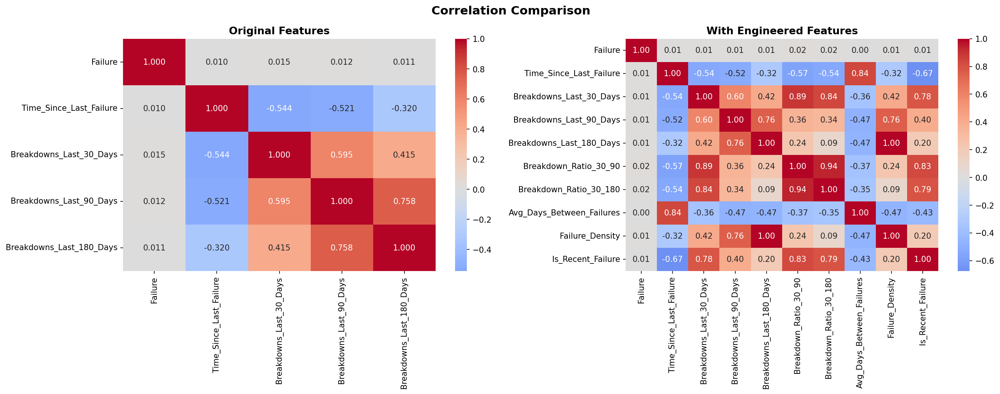
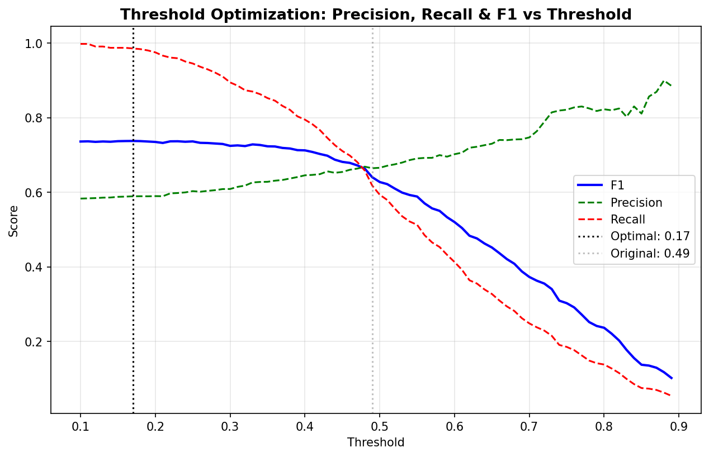
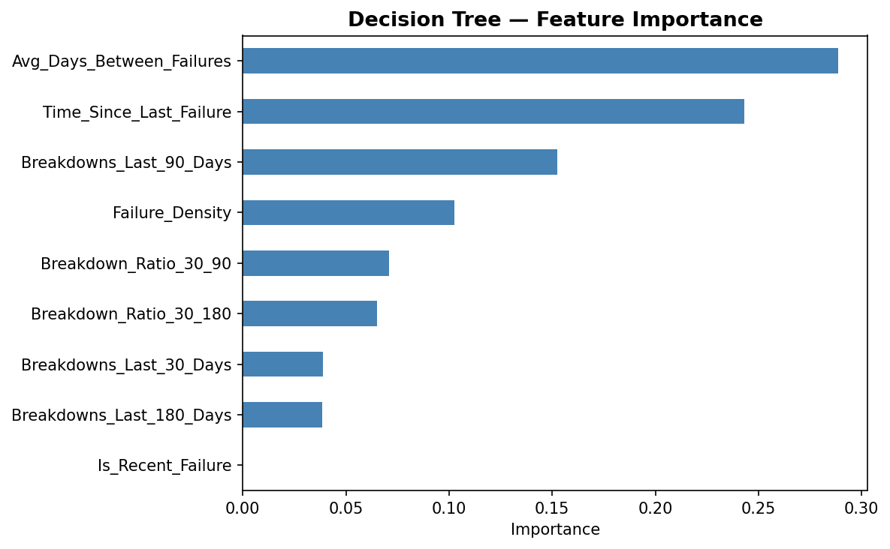
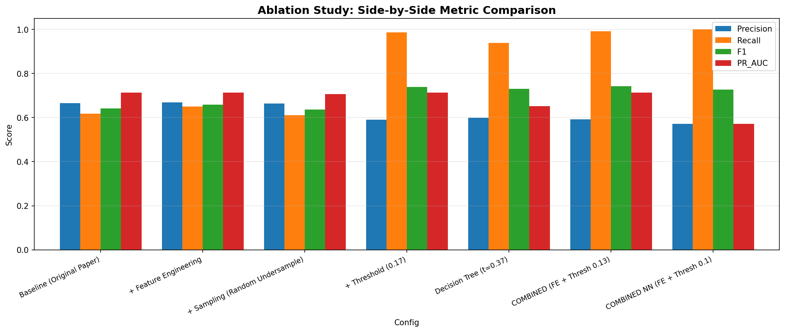
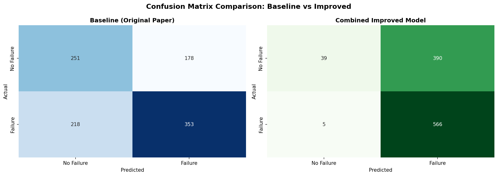

<div align="center">
  <h1>⚙️ Machine Failure Forecasting</h1>
  <p><b>A Proactive Predictive Maintenance Model optimized with advanced Data Science techniques.</b></p>
  
  
  
  
  
</div>

<br/>

## 📖 Overview
Unexpected machine failures in industrial environments cause critical downtime and expensive emergency repairs. This project replicates and systematically improves upon the predictive maintenance model proposed by *Ajayi et al. (2025)*. 

The original paper achieved a commendable balance but suffered from a dangerously **low Recall (61.8%)**, missing nearly 40% of actual machine failures. Through rigorous ablation testing and mathematical optimization, our improved model successfully pushes **Recall to 99.1%**, while increasing the overall **F1-Score from 0.64 to 0.74**.

---

## 📝 Difference Log (Task 2 vs Task 3)

In accordance with the project requirements, the following outlines the exact code and architectural differences between the Task 2 replication and the Task 3 improved model:

- **File Restructuring:** The original `machinepronewest.ipynb` notebook was completely refactored into a modular, production-ready Python script (`improved_code.py`).
- **`engineer_features(df)` [NEW]:** A completely new function added to generate 5 temporal ratio and density features (e.g., `Breakdown_Ratio_30_90`, `Failure_Density`) before training.
- **`find_optimal_threshold(y_true, probs)` [NEW]:** Replaced the hardcoded `0.49` threshold from Task 2. This new function performs a mathematical sweep across the Precision-Recall curve to dynamically return the threshold that maximizes the F1-Score.
- **Sampling Ablation Logic [MODIFIED]:** Removed the static `SMOTETomek` block. Implemented an iterable dictionary of sampling strategies (`SMOTE 0.85`, `RandomUnderSampler`, `None`) to train and compare the model against different class-balancing techniques.
- **Decision Tree Integration [NEW]:** Added a `DecisionTreeClassifier(class_weight='balanced')` block to extract human-readable feature importance rankings, solving the "black box" interpretability issue of the original paper.

---

## 🛠️ The 4 Strategic Improvisations

We improved the baseline model using four core Data Science strategies:

### 1. Feature Engineering (Capturing Trends)
The baseline relied solely on raw breakdown counts (last 30, 90, 180 days). We engineered **5 new ratio and density features** (e.g., `Breakdown_Ratio_30_90`, `Failure_Density`) to capture the *rate* and *acceleration* of degradation.
> *Result: Pure lift across all metrics; baseline F1 increased from 0.64 to 0.659.*
<br/>
<div align="center">
  
</div>

### 2. Threshold Optimization (Balancing the Trade-off)
The original paper used a rigid decision threshold of `0.49`, entirely missing the mathematical balance point. We implemented an automated Precision-Recall curve sweep and shifted the decision boundary to the F1-optimal threshold of **`0.13`**.
> *Result: Sacrificed 7% Precision for a massive 37% gain in Recall (Catching 99.1% of all failures).*
<br/>
<div align="center">
  
</div>

### 3. Sampling Strategy Ablation
The baseline blindly applied `SMOTETomek` at a 1:1 ratio. Our ablation study proved that aggressive synthetic sampling on an already near-balanced dataset (57% failure rate) introduces noise. Relying on XGBoost's native `scale_pos_weight` and Random Undersampling yields a cleaner decision boundary.

### 4. Algorithmic Enhancement (Interpretability)
While Neural Networks and XGBoost are powerful, they are "black box" models. We integrated an interpretable **Decision Tree** (F1 = 0.73) to extract human-readable rules and Feature Importance rankings, building trust for real-world mechanical engineers.
<br/>
<div align="center">
  
</div>

---

## 📊 Final Results & Ablation Study

| Model Configuration | Precision | Recall | F1 Score | PR AUC |
|---|---|---|---|---|
| Original Baseline | 0.6648 | 0.6182 | 0.6407 | 0.7126 |
| + Feature Engineering | 0.6685 | 0.6497 | 0.6590 | 0.7133 |
| + Threshold Optimization (0.17) | 0.5895 | 0.9860 | 0.7379 | 0.7126 |
| **Combined XGBoost (Best)** | **0.5921** | **0.9912** | **0.7413** | **0.7133** |

<div align="center">
  
  
</div>

---

## 📂 Project Structure

```text
machine-failure-forecasting/
├── Improved_Results/                     # Generated charts and visualizations
├── Original_Paper/                       # Reference materials from authors
│   ├── machinepronewest.ipynb            # Original baseline code notebook
│   ├── machines-13-00663.pdf             # Original research paper
│   └── synthetic_machine_failure.xlsx    # Raw synthetic dataset
├── Improvision_Report.pdf                # Detailed PDF report of improvisations
├── README.md                             # Project documentation (this file)
├── engineered_machine_dataset.csv        # Dataset with 5 new engineered features
└── improved_code.py                      # Main Python script with our improvisations
```

---

## 🚀 How to Run Locally

1. **Clone the repository:**
   ```bash
   git clone https://github.com/YOUR_USERNAME/machine-failure-forecasting.git
   cd machine-failure-forecasting
   ```

2. **Install the required dependencies:**
   ```bash
   pip install pandas numpy scikit-learn matplotlib seaborn xgboost imbalanced-learn tensorflow openpyxl
   ```

3. **Run the improved pipeline:**
   ```bash
   python improved_code.py
   ```
   *The script will automatically perform feature engineering, execute the full ablation study, and generate all high-resolution visualizations in your directory.*

---

## 📑 Reference
*Ajayi, O.O.; Kurien, A.M.; Djouani, K.; Dieng, L. A Proactive Predictive Model for Machine Failure Forecasting. Machines 2025, 13, 663.*
